# Go ADK Agent with AG-UI Integration

A Go-based agent using Google's Agent Development Kit (ADK) with AG-UI protocol support. Provides dual transport (SSE and Connect RPC) for real-time agent communication.

## Features

- 🤖 **Google ADK Integration** - Official ADK Go library
- 🔌 **AG-UI Protocol** - Dual transport (SSE + Connect RPC)
- 🚀 **Type-Safe RPC** - Connect RPC with Protocol Buffers
- 💨 **Real-Time Streaming** - Server-Sent Events support
- ⏰ **Time Agent** - Tells current time in cities worldwide

## Quick Start

### Prerequisites

- Go 1.24.4+
- Google API Key from [Google AI Studio](https://aistudio.google.com/apikey)

### Setup

```bash
cd agent-go-ag-ui
./scripts/setup-agent-go.sh
```

### Configure API Key

```bash
# Create .env file
echo 'GOOGLE_API_KEY="your_api_key_here"' > .env
```

### Run

```bash
./scripts/run-agent-go.sh
```

Server starts on `http://localhost:8000`

**Auto-Reload**: Scripts use `reflex` for automatic restart on file changes. Install manually:
```bash
go install github.com/cespare/reflex@latest
```

Or run without auto-reload:
```bash
go run ./cmd/server
```

## Architecture & Data Flow

```mermaid
sequenceDiagram
    participant Client
    participant Transport as Transport Layer<br/>(SSE or Connect RPC)
    participant Adapter as AG-UI Adapter<br/>internal/agui_adapter
    participant ADK as ADK Agent
    
    Client->>Transport: POST /sse or /connect<br/>RunAgentInput
    Transport->>Transport: Convert to agui_adapter.RunAgentInput
    Transport->>Adapter: RunAgent()
    Adapter->>ADK: Execute agent
    ADK-->>Adapter: ADK events
    Adapter->>Adapter: Convert ADK → AG-UI events
    Adapter-->>Transport: AG-UI events (channel)
    Transport->>Transport: Serialize (SSE or Protobuf)
    Transport->>Client: Stream events
```



**Key Design**: Both SSE and Connect RPC share the same adapter - no code duplication.

## Project Structure

```
agent-go-ag-ui/
├── cmd/server/main.go              # Entry point
├── internal/
│   ├── domain/                     # Shared types
│   ├── agent/                      # Agent logic
│   ├── agui_adapter/               # ADK ↔ AG-UI conversion (shared)
│   └── transport/                  # Transport layer
│       ├── sse/                    # SSE handler
│       └── connectrpc/             # Connect RPC handler
├── proto/agui/v1/agui.proto        # Protocol definitions
└── gen/                            # Generated code
```

## Endpoints

- **`POST /sse`** - Server-Sent Events (JSON stream)
- **`POST /agui.v1.AGUIService/RunAgent`** - Connect RPC (Protobuf stream)

Both support the same AG-UI protocol events: `RUN_STARTED`, `TEXT_MESSAGE_CONTENT`, `TOOL_CALL_*`, `RUN_FINISHED`, etc.

**Request Format:**
```json
{
  "threadId": "string",
  "messages": [{"id": "msg-1", "role": "user", "content": "..."}],
  "state": {},
  "tools": []
}
```

## Configuration

**Environment Variables:**
- `GOOGLE_API_KEY` (required)
- `PORT` (optional, default: 8000)

## Development

```bash
# Build
go build -o server ./cmd/server

# Test
go test ./...

# Generate protobuf code
buf generate
```

## Dependencies

- `google.golang.org/adk` - Agent Development Kit
- `github.com/ag-ui-protocol/ag-ui/sdks/community/go/pkg/core/events` - AG-UI events
- `connectrpc.com/connect` - Connect RPC framework
- `google.golang.org/genai` - Gemini API client
- Standard library (HTTP, JSON)

**Note**: Custom SSE encoding (no external SSE library) - format: `data: {json}\n\n`

## Troubleshooting

- **Missing API Key**: Set `GOOGLE_API_KEY` in `.env` or environment
- **Port in use**: Change with `PORT=8080 go run ./cmd/server`
- **Frontend can't connect**: Verify agent runs on port 8000 and CORS headers are set

## Documentation

- **[Connect RPC Guide](docs/CONNECT_RPC.md)** - Detailed Connect RPC implementation

## License

MIT
