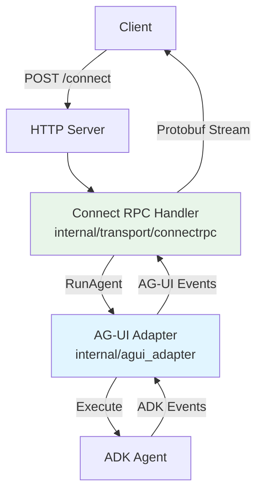
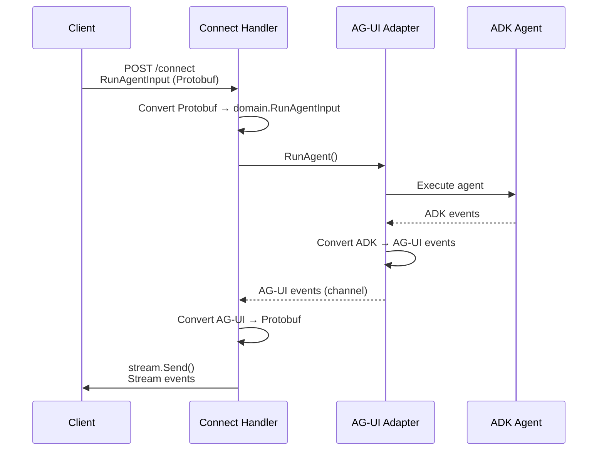

# Connect RPC Implementation Guide

A concise guide to the Connect RPC implementation in the Go ADK Agent.

## What is Connect RPC?

Connect RPC is a slim library for building browser- and gRPC-compatible HTTP APIs with:
- **Type Safety**: Code generation from Protocol Buffers
- **Streaming**: Native support for server-side streaming
- **Multiple Protocols**: Connect, gRPC, and gRPC-Web
- **Performance**: Binary Protobuf encoding

## Architecture



## Data Flow



## Implementation

### 1. Protocol Buffer Definition

**File:** `proto/agui/v1/agui.proto`

```protobuf
service AGUIService {
  rpc RunAgent(RunAgentInput) returns (stream AGUIEvent);
}
```

### 2. Code Generation

```bash
buf generate
```

Generates:
- `gen/proto/agui/v1/agui.pb.go` - Message types
- `gen/proto/agui/v1/aguiv1connect/agui.connect.go` - HTTP handlers

### 3. Handler Implementation

**File:** `internal/transport/connectrpc/handler.go`

```go
type Handler struct {
    adapter  *agui_adapter.AGUIAdapter
    stateMgr *transport.StateManager
    appName  string
}

func (h *Handler) RunAgent(
    ctx context.Context,
    req *aguiv1.RunAgentInput,
    stream *connect.ServerStream[aguiv1.AGUIEvent],
) error {
    // 1. Convert Protobuf → domain.RunAgentInput
    runInput, err := h.convertRunAgentInput(req)
    
    // 2. Use shared adapter (same as SSE)
    eventChan, err := h.adapter.RunAgent(ctx, runInput, ...)
    
    // 3. Convert and stream events
    for event := range eventChan {
        aguiEvent := h.convertAGUIEvent(event)
        stream.Send(aguiEvent)
    }
    
    return nil
}
```

### 4. Server Registration

**File:** `internal/server/server.go`

```go
// Standard Connect path
path, handler := aguiv1connect.NewAGUIServiceHandler(connectHandler)
mux.Handle(path, handler)  // /agui.v1.AGUIService/

// Simple path
mux.HandleFunc("/connect", handler.ServeHTTP)
```

## Key Points

1. **Shared Adapter**: Both SSE and Connect RPC use the same `agui_adapter.AGUIAdapter` - no code duplication
2. **Type Safety**: Protobuf provides compile-time type checking
3. **Conversion**: Only converts between Protobuf ↔ domain types, not business logic
4. **Streaming**: Events streamed in real-time via `stream.Send()`

## Comparison: SSE vs Connect RPC

| Aspect | SSE | Connect RPC |
|--------|-----|-------------|
| **Format** | JSON (text) | Protobuf (binary) or JSON |
| **Type Safety** | Manual validation | Automatic (generated) |
| **Performance** | Good | Better (binary) |
| **gRPC Compatible** | No | Yes |
| **Code Generation** | No | Yes |

**Both use the same adapter** - only the transport layer differs.

## Example Usage

### Request

```bash
curl -X POST http://localhost:8000/connect \
  -H "Content-Type: application/json" \
  -d '{
    "thread_id": "thread-123",
    "messages": [{
      "id": "msg-1",
      "role": "user",
      "content": "What time is it in Paris?"
    }]
  }'
```

### Response (Stream)

Events streamed in real-time:

```json
{"type": "run_started", "data": {...}}
{"type": "text_message_start", "data": {...}}
{"type": "text_message_content", "data": {"content": "The time"}}
{"type": "text_message_content", "data": {"content": " in Paris"}}
{"type": "text_message_end", "data": {...}}
{"type": "run_finished", "data": {...}}
```

## Troubleshooting

- **Code not generating**: Ensure `buf` and plugins are installed and in PATH
- **Type mismatches**: Run `buf generate` after changing `.proto` files
- **Stream issues**: Check context cancellation

## Further Reading

- [Connect RPC Docs](https://connectrpc.com/docs/go/getting-started)
- [Protocol Buffers Guide](https://protobuf.dev/)
- [Buf Documentation](https://buf.build/docs)
