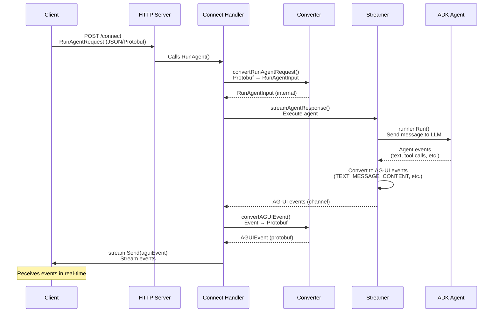

# Connect RPC Implementation Guide

This document provides a comprehensive explanation of the Connect RPC implementation in the Go ADK Agent, including architecture, data flow, and implementation details.

## Table of Contents

1. [What is Connect RPC?](#what-is-connect-rpc)
2. [Architecture Overview](#architecture-overview)
3. [Implementation Flow](#implementation-flow)
4. [Data Flow](#data-flow)
5. [Key Components](#key-components)
6. [Protocol Buffers](#protocol-buffers)
7. [Code Generation](#code-generation)
8. [Handler Implementation](#handler-implementation)
9. [Server Integration](#server-integration)
10. [Comparison: SSE vs Connect RPC](#comparison-sse-vs-connect-rpc)

## What is Connect RPC?

Connect RPC is a slim library for building browser- and gRPC-compatible HTTP APIs. It provides:

- **Type Safety**: Code generation from Protocol Buffer schemas
- **Multiple Protocols**: Supports Connect, gRPC, and gRPC-Web protocols
- **Streaming**: Native support for server-side streaming
- **Compatibility**: Works with standard gRPC tools and clients
- **HTTP/1.1 and HTTP/2**: Works over both protocols

### Why Use Connect RPC?

1. **Type Safety**: Automatic code generation ensures compile-time type checking
2. **Performance**: Binary Protobuf encoding is more efficient than JSON
3. **Interoperability**: Compatible with gRPC ecosystem tools
4. **Developer Experience**: Less boilerplate, more maintainable code

## Architecture Overview

```
┌─────────────────────────────────────────────────────────────┐
│                        Client                                │
│              (HTTP/Connect/gRPC Client)                     │
└──────────────────────┬──────────────────────────────────────┘
                       │
                       │ POST /connect
                       │ or
                       │ POST /agui.v1.AGUIService/RunAgent
                       ▼
┌─────────────────────────────────────────────────────────────┐
│                    HTTP Server                               │
│                      (:8000)                                 │
│  ┌──────────────────────────────────────────────────────┐  │
│  │              HTTP Mux (Router)                        │  │
│  │  ┌──────────────┐         ┌──────────────────────┐  │  │
│  │  │  /sse        │         │  /connect             │  │  │
│  │  │  (SSE)       │         │  (Connect RPC)        │  │  │
│  │  └──────────────┘         └──────────────────────┘  │  │
│  └──────────────────────────────────────────────────────┘  │
└──────────────────────┬──────────────────────────────────────┘
                       │
                       ▼
┌─────────────────────────────────────────────────────────────┐
│              Connect RPC Layer                               │
│  ┌──────────────────────────────────────────────────────┐  │
│  │  Generated Code (aguiv1connect)                      │  │
│  │  - AGUIServiceHandler interface                       │  │
│  │  - HTTP handler creation                              │  │
│  └──────────────────────┬───────────────────────────────┘  │
│                         │                                    │
│  ┌──────────────────────▼───────────────────────────────┐  │
│  │  ConnectHandler (Implementation)                     │  │
│  │  - RunAgent() method                                 │  │
│  │  - Request/Response conversion                       │  │
│  └──────────────────────┬───────────────────────────────┘  │
└─────────────────────────┼──────────────────────────────────┘
                          │
                          ▼
┌─────────────────────────────────────────────────────────────┐
│              Business Logic Layer                            │
│  ┌──────────────┐  ┌──────────────┐  ┌──────────────┐      │
│  │  Converter   │  │   Streamer   │  │ StateManager│      │
│  │  Protobuf ↔  │  │  Executes    │  │  Manages    │      │
│  │  Internal    │  │   Agent      │  │   State     │      │
│  └──────────────┘  └──────────────┘  └──────────────┘      │
│                          │                                    │
│  ┌───────────────────────▼──────────────────────────────┐   │
│  │           SessionManager                             │   │
│  │           Manages conversation sessions              │   │
│  └───────────────────────┬──────────────────────────────┘   │
└───────────────────────────┼──────────────────────────────────┘
                            │
                            ▼
┌─────────────────────────────────────────────────────────────┐
│              Google ADK Layer                                │
│  ┌──────────────┐              ┌──────────────┐            │
│  │    Runner    │──────────────▶│ ADK Agent   │            │
│  │  Executes    │              │  (LlmAgent) │            │
│  │   Agent      │              │             │            │
│  └──────────────┘              └──────────────┘            │
└─────────────────────────────────────────────────────────────┘
```

## Implementation Flow

### Step 1: Define Service (Protocol Buffers)

**File:** `proto/agui/v1/agui.proto`

```protobuf
service AGUIService {
  rpc RunAgent(RunAgentRequest) returns (stream AGUIEvent);
}
```

This defines:
- **Service**: `AGUIService` - The RPC service
- **Method**: `RunAgent` - The RPC method name
- **Request**: `RunAgentRequest` - Input message (Protobuf)
- **Response**: `stream AGUIEvent` - Output as a stream of events

### Step 2: Generate Code

When you run `buf generate`, two code generators run:

1. **`protoc-gen-go`** generates:
   - `gen/proto/agui/v1/agui.pb.go` - Go types for messages
   - Types: `RunAgentRequest`, `AGUIEvent`, `Message`, etc.

2. **`protoc-gen-connect-go`** generates:
   - `gen/proto/agui/v1/aguiv1connect/agui.connect.go` - HTTP handlers
   - Interface: `AGUIServiceHandler` - What you need to implement
   - Function: `NewAGUIServiceHandler()` - Creates HTTP handler

### Step 3: Implement Handler

**File:** `internal/agui/connect_handler.go`

```go
type ConnectHandler struct {
    agent      agent.Agent
    streamer   *Streamer
    stateMgr   *StateManager
    appName    string
}

func (h *ConnectHandler) RunAgent(
    ctx context.Context,
    req *aguiv1.RunAgentRequest,  // Generated type from .proto
    stream *connect.ServerStream[aguiv1.AGUIEvent],  // Stream for events
) error {
    // Implementation here
}
```

### Step 4: Register in Server

**File:** `internal/server/server.go`

```go
// Create handler from generated code
path, handler := aguiv1connect.NewAGUIServiceHandler(connectHandler)

// Register in HTTP router
mux.Handle(path, handler)  // Standard path: /agui.v1.AGUIService/
mux.HandleFunc("/connect", handler.ServeHTTP)  // Simple path: /connect
```

## Data Flow



### Detailed Flow Explanation

1. **Client Request**: Client sends `RunAgentRequest` to `/connect` endpoint
2. **Server Routing**: HTTP server routes to Connect handler
3. **Request Conversion**: Protobuf request converted to internal `RunAgentInput`
4. **Agent Execution**: Streamer executes the ADK agent
5. **Event Generation**: Agent generates events (text chunks, tool calls, etc.)
6. **Event Conversion**: Internal events converted to Protobuf `AGUIEvent`
7. **Stream Response**: Events sent to client via `stream.Send()`

## Key Components

### 1. Generated Code (`gen/proto/agui/v1/`)

#### Message Types (`agui.pb.go`)

```go
// Generated from proto/agui/v1/agui.proto
type RunAgentRequest struct {
    ThreadId       string
    RunId          string
    State          *structpb.Struct
    Messages       []*Message
    Tools          []*structpb.Value
    Context        []*structpb.Value
    ForwardedProps *structpb.Struct
}

type AGUIEvent struct {
    Type string
    Data *structpb.Struct
}
```

#### Connect Handler (`aguiv1connect/agui.connect.go`)

```go
// Interface you must implement
type AGUIServiceHandler interface {
    RunAgent(
        context.Context,
        *RunAgentRequest,
        *connect.ServerStream[AGUIEvent],
    ) error
}

// Function that creates HTTP handler
func NewAGUIServiceHandler(
    svc AGUIServiceHandler,
    opts ...connect.HandlerOption,
) (string, http.Handler)
```

### 2. ConnectHandler (`internal/agui/connect_handler.go`)

**Responsibilities:**

1. **Receive Request**: Accept `RunAgentRequest` (Protobuf)
2. **Convert Request**: Transform Protobuf → Internal `RunAgentInput`
3. **Execute Agent**: Reuse existing `Streamer` logic
4. **Convert Events**: Transform AG-UI events → Protobuf `AGUIEvent`
5. **Stream Response**: Send events via `stream.Send()`

**Key Methods:**

```go
// Main RPC method
func (h *ConnectHandler) RunAgent(...) error

// Convert Protobuf request to internal format
func (h *ConnectHandler) convertRunAgentRequest(...) (*RunAgentInput, error)

// Convert AG-UI event to Protobuf
func (h *ConnectHandler) convertAGUIEvent(...) (*aguiv1.AGUIEvent, error)

// Execute agent and collect events
func (h *ConnectHandler) streamAgentResponse(...) error
```

### 3. Converters

The handler includes conversion functions to bridge between Protobuf types and internal Go types:

```go
// Protobuf → Internal
convertRunAgentRequest(req *aguiv1.RunAgentRequest) → *RunAgentInput

// Internal → Protobuf
convertAGUIEvent(event events.Event) → *aguiv1.AGUIEvent
```

**Why Converters?**

- **Protobuf Types**: Used for API contract (external interface)
- **Internal Types**: Used for business logic (internal implementation)
- **Separation**: Keeps API contract separate from implementation

### 4. Streamer Reuse

The `ConnectHandler` reuses the existing `Streamer` logic:

```go
// Same Streamer used by SSE handler
streamer := agui.NewStreamer(adkAgent, sessionMgr, cfg.AppName)

// Used by both handlers
sseHandler := agui.NewHandler(adkAgent, streamer, stateMgr, cfg.AppName)
connectHandler := agui.NewConnectHandler(adkAgent, streamer, stateMgr, cfg.AppName)
```

**Benefits:**
- Code reuse
- Consistent behavior
- Single source of truth

## Protocol Buffers

### Schema Definition

**File:** `proto/agui/v1/agui.proto`

```protobuf
syntax = "proto3";

package agui.v1;

// Message represents an AG-UI message
message Message {
  string id = 1;
  string role = 2;
  google.protobuf.Value content = 3;
  string name = 4;
  google.protobuf.Value tool_calls = 5;
}

// RunAgentRequest represents the input for running an agent
message RunAgentRequest {
  string thread_id = 1;
  string run_id = 2;
  google.protobuf.Struct state = 3;
  repeated Message messages = 4;
  repeated google.protobuf.Value tools = 5;
  repeated google.protobuf.Value context = 6;
  google.protobuf.Struct forwarded_props = 7;
}

// AGUIEvent represents any AG-UI protocol event
message AGUIEvent {
  string type = 1;                    // Event type
  google.protobuf.Struct data = 2;    // Event data (flexible)
}

// Service definition
service AGUIService {
  rpc RunAgent(RunAgentRequest) returns (stream AGUIEvent);
}
```

### Key Design Decisions

1. **Flexible Events**: Using `google.protobuf.Struct` for event data allows any JSON-serializable structure
2. **Streaming Response**: `stream AGUIEvent` enables real-time event streaming
3. **Repeated Fields**: `repeated` allows arrays of messages, tools, etc.

## Code Generation

### Configuration Files

#### `buf.yaml`

```yaml
version: v2
lint:
  use:
    - DEFAULT
breaking:
  use:
    - FILE
```

#### `buf.gen.yaml`

```yaml
version: v2
plugins:
  - local: protoc-gen-go
    out: gen
    opt: paths=source_relative
  - local: protoc-gen-connect-go
    out: gen
    opt:
      - paths=source_relative
      - simple
managed:
  enabled: true
  override:
    - file_option: go_package_prefix
      value: agent-go-ag-ui/gen
```

### Generation Process

```bash
# 1. Install tools
go install github.com/bufbuild/buf/cmd/buf@latest
go install google.golang.org/protobuf/cmd/protoc-gen-go@latest
go install connectrpc.com/connect/cmd/protoc-gen-connect-go@latest

# 2. Update dependencies
buf dep update

# 3. Generate code
buf generate
```

### Generated Files

```
gen/
└── proto/
    └── agui/
        └── v1/
            ├── agui.pb.go              # Message types
            └── aguiv1connect/
                └── agui.connect.go     # Connect handlers
```

## Handler Implementation

### Request Processing

```go
func (h *ConnectHandler) RunAgent(
    ctx context.Context,
    req *aguiv1.RunAgentRequest,
    stream *connect.ServerStream[aguiv1.AGUIEvent],
) error {
    // 1. Convert Protobuf → Internal
    runInput, err := h.convertRunAgentRequest(req)
    
    // 2. Validate
    if err := handler.ValidateMessages(runInput.Messages); err != nil {
        // Send error event
        return nil
    }
    
    // 3. Handle state
    mergedState := h.stateMgr.Merge(threadID, runInput.State)
    
    // 4. Execute agent (reuses Streamer logic)
    eventChan := make(chan events.Event, 100)
    go h.streamAgentResponse(ctx, runInput.Messages, ...)
    
    // 5. Stream events
    for event := range eventChan {
        aguiEvent := h.convertAGUIEvent(event)
        stream.Send(aguiEvent)
    }
    
    return nil
}
```

### Event Streaming

Events are sent as they're generated:

```go
// Send RUN_STARTED
stream.Send(runStartedEvent)

// Send TEXT_MESSAGE_START
stream.Send(textStartEvent)

// Send TEXT_MESSAGE_CONTENT (multiple chunks)
for chunk := range textChunks {
    stream.Send(contentEvent)
}

// Send TEXT_MESSAGE_END
stream.Send(textEndEvent)

// Send RUN_FINISHED
stream.Send(runFinishedEvent)
```

## Server Integration

### Endpoint Registration

**File:** `internal/server/server.go`

```go
const (
    EndpointSSE     = "/sse"
    EndpointConnect = "/connect"
)

func New(cfg *config.Config, sseHandler *agui.Handler, connectHandler *agui.ConnectHandler) *Server {
    mux := http.NewServeMux()
    
    // SSE endpoint
    mux.HandleFunc(EndpointSSE, sseHandler.HandleAgentRequest)
    
    // Connect RPC endpoint
    if connectHandler != nil {
        // Standard Connect path (for gRPC compatibility)
        path, handler := aguiv1connect.NewAGUIServiceHandler(connectHandler)
        mux.Handle(path, handler)
        
        // Explicit path (for convenience)
        mux.HandleFunc(EndpointConnect, handler.ServeHTTP)
    }
    
    return &Server{...}
}
```

### Why Two Paths?

1. **Standard Path** (`/agui.v1.AGUIService/`):
   - Follows gRPC/Connect conventions
   - Full path: `/agui.v1.AGUIService/RunAgent`
   - Compatible with standard gRPC clients

2. **Explicit Path** (`/connect`):
   - Simpler, more readable
   - Easier for testing with `curl`
   - Same handler, different route

## Comparison: SSE vs Connect RPC

| Aspect | SSE | Connect RPC |
|--------|-----|-------------|
| **Protocol** | HTTP/1.1 + SSE | HTTP/1.1, HTTP/2, gRPC |
| **Format** | JSON (text) | Protobuf (binary) or JSON |
| **Type Safety** | Manual (JSON validation) | Automatic (generated code) |
| **Streaming** | Native (SSE) | Native (streams) |
| **Browser Support** | Excellent | Good (via gRPC-Web) |
| **gRPC Compatibility** | No | Yes |
| **Performance** | Good | Better (binary encoding) |
| **Code Generation** | No | Yes |

### When to Use Each

**Use SSE when:**
- Simple browser integration needed
- JSON is preferred
- No gRPC ecosystem requirements

**Use Connect RPC when:**
- Type safety is important
- Better performance needed
- gRPC compatibility required
- Multiple protocol support needed

## Example Usage

### Client Request (JSON)

```bash
curl -X POST http://localhost:8000/connect \
  -H "Content-Type: application/json" \
  -d '{
    "thread_id": "thread-123",
    "run_id": "run-456",
    "messages": [{
      "id": "msg-1",
      "role": "user",
      "content": "What time is it in Paris?"
    }]
  }'
```

### Server Response (Stream)

The server responds with a stream of events:

```json
{"type": "run_started", "data": {"thread_id": "thread-123", "run_id": "run-456"}}
{"type": "text_message_start", "data": {"message_id": "msg-789", "role": "assistant"}}
{"type": "text_message_content", "data": {"message_id": "msg-789", "content": "The time in Paris is"}}
{"type": "text_message_content", "data": {"message_id": "msg-789", "content": " 3:45 PM"}}
{"type": "text_message_end", "data": {"message_id": "msg-789"}}
{"type": "run_finished", "data": {"thread_id": "thread-123", "run_id": "run-456"}}
```

## Key Go Concepts Used

### 1. Interfaces

```go
// Interface defines the contract
type AGUIServiceHandler interface {
    RunAgent(...) error
}

// Our implementation
type ConnectHandler struct { ... }
func (h *ConnectHandler) RunAgent(...) error { ... }
```

### 2. Generics

```go
// Type-safe stream
stream *connect.ServerStream[aguiv1.AGUIEvent]
```

### 3. Context

```go
// For cancellation and timeouts
ctx context.Context
```

### 4. Error Handling

```go
// Typed errors
return connect.NewError(connect.CodeInvalidArgument, err)
```

### 5. Channels

```go
// For async event streaming
eventChan := make(chan events.Event, 100)
```

## Testing

### Test with `buf curl`

```bash
# Using Connect protocol
buf curl \
  --schema ./proto \
  --data '{"thread_id": "test", "messages": [...]}' \
  http://localhost:8000/connect
```

### Test with Standard HTTP

```bash
# JSON request
curl -X POST http://localhost:8000/connect \
  -H "Content-Type: application/json" \
  -d @request.json
```

## Troubleshooting

### Common Issues

1. **Code not generating**: Check that `buf` and plugins are in PATH
2. **Type mismatches**: Regenerate code after changing `.proto` files
3. **Stream not working**: Ensure context is not cancelled prematurely
4. **Conversion errors**: Check that Protobuf Struct fields match internal types

## Further Reading

- [Connect RPC Documentation](https://connectrpc.com/docs/go/getting-started)
- [Protocol Buffers Guide](https://protobuf.dev/)
- [Buf Documentation](https://buf.build/docs)

## Summary

The Connect RPC implementation provides:

1. **Type Safety**: Automatic code generation from Protocol Buffers
2. **Flexibility**: Multiple protocol support (Connect, gRPC, gRPC-Web)
3. **Performance**: Binary encoding for better efficiency
4. **Maintainability**: Less boilerplate, more maintainable code
5. **Compatibility**: Works with gRPC ecosystem tools

The implementation reuses existing business logic (Streamer, StateManager) while providing a modern, type-safe API interface.

